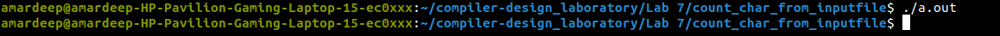

## Here is the terminal input and output of the <code>./a.out</code> file

</img>
 

### Here is the input text file for the given program
`
I
am
a 
middler
in
IIIT
Ranchi
`

### Here is the output text file for the given input
<code>
Total Characters detected : 33 
 No. of tabs : 0 
 No. of Lines: 8  
 No. of white spaces: 2  
 Other Characters: 23 
 </code>
 
