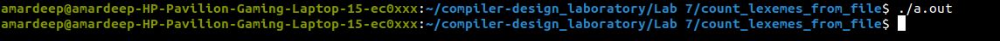

## Here is the terminal input and output of the <code>./a.out</code> file

</img>
 

### Here is the input file for the given program
<code>
int a = 149 + 100;
</code>

### Here is the output file for the given input file
<code>   
No. of lexemes=7
No. of keywords=1
No. of identifiers=1
No. of integers=2
No. of fractions=0
No. of operators=3
</code>
