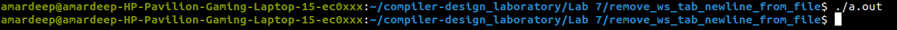

## Here is the terminal input and output of the <code>./a.out</code> file

</img>
 

### Here is the input file for the given program
<code>
int a = 149 + 100;int a =   101 + 309;
print(a);
</code>

### Here is the output file for the given input file
<code>   
int a = 101 + 309;print(a);
</code>
